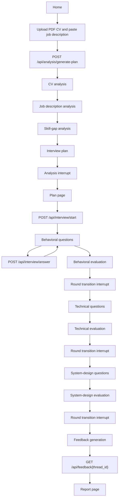
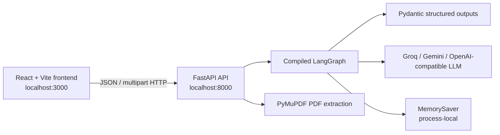
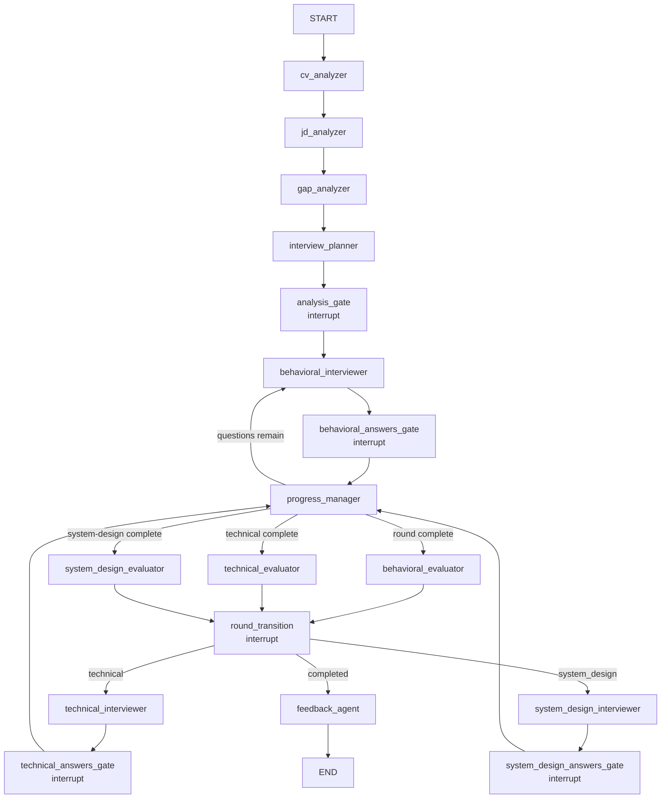

# PromptHire

**AI-powered, role-aware interview simulation with CV analysis, job-fit analysis, three interview rounds, and structured feedback.**

PromptHire is a AI interview simulation application. A candidate uploads a PDF CV and supplies a job description. The FastAPI backend uses LangChain and LangGraph to analyze the inputs, identify skill gaps, generate a behavioral/technical/system-design interview plan, conduct the interview one question at a time, evaluate each round, and produce a structured final feedback model. The React frontend presents that workflow as a browser application.

This repository contains a working local-development implementation. It does **not** contain authentication, a database, durable checkpoint storage, deployment manifests, or automated test files.

## Contents

- [Implemented capabilities](#implemented-capabilities)
- [User journey](#user-journey)
- [Architecture](#architecture)
- [Technology stack](#technology-stack)
- [Backend and LangGraph](#backend-and-langgraph)
- [Frontend](#frontend)
- [API reference](#api-reference)
- [Data contracts](#data-contracts)
- [Local development](#local-development)
- [Testing](#testing)
- [Troubleshooting](#troubleshooting)
- [Production, security, and scalability](#production-security-and-scalability)
- [Future work](#future-work)
- [Contributing](#contributing)
- [License](#license)

## Implemented capabilities

- PDF CV upload and text extraction with PyMuPDF.
- Job description submission as form data.
- Structured CV analysis, job-description analysis, skill-gap analysis, and interview-plan generation.
- Three generated interview rounds:
	- Behavioral
	- Technical
	- System design
- Per-question human-in-the-loop pauses using LangGraph `interrupt()`.
- Resume of the same graph thread using `Command(resume=...)`.
- Behavioral, technical, and system-design evaluation nodes.
- Structured final feedback using the Pydantic `FeedbackModel`.
- Browser-side session state through React `InterviewContext`.
- A report view with scores, performance summaries, strengths, improvement items, next steps, final feedback, and JSON download.
- FastAPI CORS configuration for local development and configurable origins.
- LLM provider selection with Groq, Gemini, and OpenAI-compatible providers, including ordered fallbacks.

The current implementation communicates over ordinary JSON HTTP requests. Although the frontend contains an SSE utility, no active page uses it and the backend does not expose an SSE route.

## User journey



At each stage, the frontend retains the returned `thread_id`. That identifier is the key used to resume and read the corresponding LangGraph checkpoint.

## Architecture



The frontend owns presentation, browser navigation, transient UI state, and the uploaded `File`. The backend owns document extraction, LLM calls, interview state, graph control flow, evaluation, and final feedback. There is no persistence layer outside the LangGraph in-memory checkpointer.


## Technology stack

| Technology | Use in this repository |
| --- | --- |
| Python 3.14+ | Backend runtime required by `backend/pyproject.toml`. |
| FastAPI | HTTP API, multipart upload handling, validation, CORS, and OpenAPI documentation. |
| Uvicorn | ASGI development server. |
| LangGraph | Stateful interview workflow, conditional routing, interrupts, and checkpoints. |
| LangChain / LangChain Core | Prompt and message abstractions and model composition. |
| `langchain-groq` | Groq chat-model integration. |
| `langchain-google-genai` | Gemini chat-model integration. |
| `langchain-openai` | OpenAI-compatible chat-model integration. |
| Pydantic 2 | Structured LLM outputs and FastAPI request validation. |
| PyMuPDF | Extracting text from uploaded PDFs. |
| React 19 | Frontend component model and rendering. |
| TypeScript | Frontend type declarations and compiler checks. |
| Vite | Frontend development server and production bundling. |
| Tailwind CSS | Utility-based styling through the Vite plugin. |
| `lucide-react` | UI icons. |
| `motion` | Frontend animation dependency available in the package manifest. |
| `concurrently` | Root command for running backend and frontend together. |

## Backend and LangGraph

### Graph workflow

The graph is compiled in `backend/graph/main_graph.py` with `InterviewState` and a `MemorySaver` checkpointer.



The planner prompt asks for 8 behavioral questions, 10 technical questions, and 5 system-design questions. The runtime routing uses the `number_of_questions` values returned in the generated `InterviewPlanModel`; those values are not hard-coded by the routing function.

### Node responsibilities

| Node | Responsibility | Output/state effect |
| --- | --- | --- |
| `CVAnalyzerNode` | Sends extracted CV text to a structured LLM chain. | `cv_analysis: CVModel` |
| `JDAnalyzerNode` | Sends job-description text to a structured LLM chain. | `jd_analysis: JDModel` |
| `GapAnalyzerNode` | Compares CV text and job-description text. | `gap_analysis: GapAnalyzerModel` |
| `InterviewPlannerNode` | Uses the three analyses to create round plans. | `interview_plan`, behavioral round, question index reset |
| `AnalysisGateNode` | Pauses after planning so the candidate can review the plan. | `interrupt({type: "analysis_complete", ...})` |
| `BehavioralInterviewNode` | Generates one behavioral question from the behavioral plan and message history. | Appends `AIMessage`, increments question index |
| `TechnicalInterviewNode` | Generates one technical question from the technical plan and message history. | Appends `AIMessage`, increments question index |
| `SystemDesignInterviewNode` | Generates one system-design question from the system-design plan and message history. | Appends `AIMessage`, increments question index |
| `AnswerGateNode` | Waits for a candidate answer. | Resumed answer becomes a `HumanMessage` |
| `ProgressManagerNode` | Compares the question index with the current plan’s count. | Sets the matching round-completed flag |
| `BehavioralEvaluatorNode` | Evaluates the accumulated interview messages with behavioral criteria. | `behavioral_evaluation` |
| `TechnicalEvaluatorNode` | Evaluates the accumulated interview messages with technical criteria. | `technical_evaluation` |
| `SystemDesignEvaluatorNode` | Evaluates the accumulated interview messages with system-design criteria. | `system_design_evaluation` |
| `RoundTransitionNode` | Pauses after an evaluation, then advances the round. | Resets question index; eventually sets `interview_completed` |
| `FeedbackNode` | Combines all three evaluations and requests structured final feedback. | `feedback: FeedbackModel` |

`backend/graph/routing.py` contains two routers. `route_after_progress` chooses the next interviewer or evaluator based on the current round and question count. `route_after_round_transition` chooses technical, system design, or completed/feedback based on the round updated by `RoundTransitionNode`.

### State

`InterviewState` extends LangGraph `MessagesState`, so it includes the message history plus these application fields:

| Field | Type/meaning |
| --- | --- |
| `cv_text` | Extracted CV text. |
| `jd_text` | Submitted job-description text. |
| `cv_analysis` | `CVModel` result. |
| `jd_analysis` | `JDModel` result. |
| `gap_analysis` | `GapAnalyzerModel` result. |
| `interview_plan` | `InterviewPlanModel` result. |
| `current_round` | `analysis`, `behavioral`, `technical`, `system_design`, or `completed`. |
| `current_question_index` | Current generated-question index. |
| `interview_completed` | Overall completion flag. |
| `behavioral_completed` | Behavioral round completion flag. |
| `technical_completed` | Technical round completion flag. |
| `system_design_completed` | System-design round completion flag. |
| `behavioral_evaluation` | Behavioral evaluator output, currently untyped/`Any`. |
| `technical_evaluation` | Technical evaluator output, currently untyped/`Any`. |
| `system_design_evaluation` | System-design evaluator output, currently untyped/`Any`. |
| `feedback` | `FeedbackModel` final result. |
| `report` | Optional report field declared by state; no separate report node populates it. |

The route that creates a session initializes the text, round, question index, and completion flags. `start.py` contains a `start_node` initializer, but it is not added to the compiled graph in `main_graph.py`.

### Sessions, thread IDs, and checkpoints

The analysis endpoint creates an identifier in the form `ph_<12 hex characters>` when the client does not submit one. Every graph request uses the same LangGraph configuration:

```python
config = {
		"configurable": {
				"thread_id": thread_id,
		}
}
```

`MemorySaver` stores checkpoints in the backend process. This enables the API requests for one `thread_id` to resume the interrupted graph, but it is not durable storage: restarting the backend process loses active sessions. There is no database or external checkpointer configured in this repository.

### Human-in-the-loop resume

The graph pauses with `langgraph.types.interrupt` in three places:

1. `AnalysisGateNode` pauses after plan generation.
2. `AnswerGateNode` pauses for every candidate answer.
3. `RoundTransitionNode` pauses after each round evaluation.

The corresponding API routes resume the same checkpoint:

```python
await graph.ainvoke(Command(resume=True), config=config)       # start/next round
await graph.ainvoke(Command(resume=answer), config=config)     # candidate answer
```

The resumed answer is validated by the route, wrapped in a `HumanMessage` by `AnswerGateNode`, and made available to subsequent interviewer and evaluator nodes.

### Analysis and LLM output

Analysis and planning nodes use `.with_structured_output(...)` with Pydantic models:

- CV analysis -> `CVModel`
- Job-description analysis -> `JDModel`
- Gap analysis -> `GapAnalyzerModel`
- Interview planning -> `InterviewPlanModel`
- Final feedback -> `FeedbackModel`

The round interviewer and evaluator nodes currently use ordinary chat-model responses. Their evaluations are stored as response content rather than dedicated Pydantic evaluation models. Prompt definitions live in `backend/prompts/`.

The LLM factory checks provider keys in this order: Groq, Gemini, then OpenAI-compatible. If more than one is configured, the first is primary and the remaining models are configured as fallbacks. At least one supported key must be present when the graph is constructed.

## Interview rounds

### Behavioral

`BehavioralInterviewNode` uses the behavioral plan and the shared LangChain message history to ask one question at a time. The prompt emphasizes concise questions, follow-ups, adapting to answers, and avoiding detailed candidate feedback during the round. After the configured number of questions, `BehavioralEvaluatorNode` evaluates the history and `RoundTransitionNode` pauses before moving to technical.

### Technical

`TechnicalInterviewNode` uses the technical plan and shared message history. The prompt directs the interviewer toward role-relevant technical depth, follow-ups, and deeper probing, and explicitly does not ask coding exercises. `TechnicalEvaluatorNode` evaluates the completed technical conversation before the transition interrupt.

### System design

`SystemDesignInterviewNode` uses the system-design plan and asks iterative design and clarification questions. Its prompt covers requirements, trade-offs, scalability, reliability, and architecture discussion. `SystemDesignEvaluatorNode` evaluates the final round. The completed transition sets `current_round` to `completed` and `interview_completed` to `True`, after which the graph routes to `FeedbackNode`.

### Progress and transitions

Each interviewer increments `current_question_index`. `ProgressManagerNode` compares that index with the current plan’s question count. A remaining question routes back to the relevant interviewer; reaching the count routes to the relevant evaluator. Each round completion then requires a separate resume of the round-transition interrupt.

## Feedback model and report

`backend/models/feedback_model.py` defines the structured final result:

| Field | Shape |
| --- | --- |
| `candidate_name` | Optional string |
| `target_role` | Optional string |
| `organization` | Optional string |
| `overall_score` | Optional number from 0 to 100 |
| `score_band` | `Excellent`, `Good`, `Average`, or `Below Average` |
| `behavioral_score` | Optional number from 0 to 100 |
| `technical_score` | Optional number from 0 to 100 |
| `system_design_score` | Optional number from 0 to 100 |
| `overall_performance` | Required executive summary string |
| `behavioral_performance` | Optional round summary |
| `technical_performance` | Optional round summary |
| `system_design_performance` | Optional round summary |
| `strengths` | List of strings |
| `areas_for_improvement` | List of `{area, evidence, why_it_matters, improvement_action}` objects |
| `role_readiness` | `Strong alignment`, `Good alignment`, `Partial alignment`, or `Significant development needed` |
| `recommended_next_steps` | List of `{priority, recommendation}` objects; priority is High/Medium/Low Priority |
| `final_feedback` | Required personalized feedback string |

The frontend `ReportPage` renders the scores, score band, readiness, overall and per-round performance, strengths, improvement details, recommended next steps, final feedback, and completion status. It also creates a client-side JSON download of the `feedback` object and can reset the browser session for a new interview.

## Frontend

### Routes

The frontend uses a manual `window.history`/pathname switch in `frontend/src/routes.tsx`; it does not use React Router.

| Path | Page | Purpose |
| --- | --- | --- |
| `/` | `Home` | Landing/navigation screen. |
| `/upload` | `UploadPage` | PDF selection, job-description entry, and plan request. |
| `/plan` | `InterviewPlan` | Displays CV/JD summaries, gap analysis, and round plan. |
| `/interview/behavioral` | `BehavioralInterview` | Starts the graph and runs the behavioral round. |
| `/interview/technical` | `TechnicalInterview` | Resumes the round transition and runs technical questions. |
| `/interview/system-design` | `SystemDesignInterview` | Resumes the round transition and runs system-design questions. |
| `/interview/complete` | `InterviewComplete` | Requests final feedback and redirects to the report. |
| `/report` | `ReportPage` | Renders final feedback and JSON export. |

### `InterviewContext`

`InterviewContext` is the application-wide client state container. It stores:

- `threadId` and candidate/job-description data.
- CV, JD, gap, and plan responses from the backend.
- Shared interview messages and current round.
- Loading/submission/report-generation flags.
- API errors and transient toast notifications.
- Manual route state and sidebar state.
- Client-side round progress.
- Reset and sample-session actions.

`useInterviewStream` is named for the earlier streaming design, but its active implementation calls the JSON methods in `services/api.ts`. It appends the candidate answer immediately, then appends the returned next question when the request succeeds. The client also prevents duplicate round initialization during React Strict Mode with a module-level `startedRounds` set.

### Frontend/backend type contracts

`frontend/src/types/index.ts` contains backend-contract interfaces and UI types; `frontend/src/types/backend.ts` currently contains only `InterviewMessage` and `ApiError`. The comments in `index.ts` describe these interfaces as mirrors of the Pydantic models, but the declarations are not fully synchronized with the current backend:

- The backend `CVModel` currently exposes `cv_id`, `candidate_name`, and `cv_summary`; the frontend interface also declares fields such as `years_of_experience` and `technical_skills`.
- The backend `JDModel` exposes `jd_id`, `job_title`, and `job_summary`; the frontend expects additional fields including `company_name`.
- The backend gap response is `GapAnalyzerModel` with `gaps`, `overall_summary`, and `priority_gaps`; the frontend declaration describes a different single-skill shape.
- The backend plan models include `evaluation_criteria`, `strong_answer_indicators`, and `weak_answer_indicators`; the frontend declaration omits some of those and includes fields not present in the backend models.

Runtime page code already accesses the actual fields returned by the backend in several places, but these declarations should be reconciled before treating TypeScript as a complete contract.

## API reference

The API is mounted by `backend/main.py` with the prefixes `/api/analysis`, `/api/interview`, and `/api/feedback`. FastAPI also exposes its generated OpenAPI documentation at `/docs` and `/redoc` when the server is running.

### `GET /`

Health-style root response:

```json
{
	"message": "PromptHire API is running",
	"status": "healthy"
}
```

### `GET /health`

Returns:

```json
{
	"status": "healthy"
}
```

### `POST /api/analysis/generate-plan`

Generates the CV analysis, JD analysis, skill-gap analysis, and interview plan, then pauses the graph at the analysis gate.

Request content type: `multipart/form-data`

| Field | Required | Description |
| --- | --- | --- |
| `cv_file` | Yes | Uploaded PDF file. The backend extracts text with PyMuPDF. |
| `job_description` | Yes | Job-description text. |
| `thread_id` | No | Existing session ID; blank or omitted creates `ph_<12 hex characters>`. |

Example:

```bash
curl -X POST http://localhost:8000/api/analysis/generate-plan \
	-F "cv_file=@./candidate.pdf" \
	-F "job_description=Senior platform engineer responsible for reliable distributed systems"
```

Success response shape:

```json
{
	"status": "success",
	"thread_id": "ph_0123456789ab",
	"cv_analysis": {
		"cv_id": "...",
		"candidate_name": "...",
		"cv_summary": "..."
	},
	"jd_analysis": {
		"jd_id": "...",
		"job_title": "...",
		"job_summary": "..."
	},
	"gap_analysis": {
		"gaps": [],
		"overall_summary": "...",
		"priority_gaps": []
	},
	"interview_plan": {
		"behavioral": {},
		"technical": {},
		"system_design": {},
		"candidate_strengths_to_validate": [],
		"candidate_weaknesses_to_investigate": [],
		"cv_claims_to_verify": [],
		"priority_job_requirements": []
	}
}
```

`400` is returned for an empty/unreadable extracted CV or blank job description. Unexpected failures are returned as `500` with the exception detail.

### `POST /api/interview/start`

Resumes the analysis-gate interrupt and starts the behavioral round.

Request:

```json
{
	"thread_id": "ph_0123456789ab"
}
```

Response:

```json
{
	"status": "success",
	"thread_id": "ph_0123456789ab",
	"question": "Tell me about a time..."
}
```

The request uses `Command(resume=True)`. Invalid request bodies produce FastAPI `422`; runtime failures produce `500`.

### `POST /api/interview/answer`

Resumes the current answer gate with the candidate’s answer.

Request:

```json
{
	"thread_id": "ph_0123456789ab",
	"answer": "I led the migration by..."
}
```

Response:

```json
{
	"status": "success",
	"thread_id": "ph_0123456789ab",
	"question": "What trade-offs did you consider?"
}
```

Blank or whitespace-only answers return `400`. The endpoint does not return the interrupt payload, round name, completion flag, or evaluation object; the frontend relies on the returned question and its own visible message count.

### `POST /api/interview/next-round`

Resumes the round-transition interrupt and starts the next round.

Request:

```json
{
	"thread_id": "ph_0123456789ab"
}
```

Response:

```json
{
	"status": "success",
	"thread_id": "ph_0123456789ab",
	"question": "Describe..."
}
```

The same endpoint is used for behavioral-to-technical, technical-to-system-design, and the final transition toward feedback. Runtime failures return `500`.

### `GET /api/feedback/{thread_id}`

Reads the current checkpoint with `graph.get_state(config)` and returns the feedback and stored evaluation values.

Response:

```json
{
	"status": "success",
	"feedback": {},
	"behavioral_evaluation": "...",
	"technical_evaluation": "...",
	"system_design_evaluation": "...",
	"interview_completed": true
}
```

If no state exists for the thread, the route returns `404`. Other failures return `500`. `FeedbackRequest` exists in the route module but is not used by this GET endpoint.

## Local development

### Prerequisites

- Python 3.14 or newer. The required version is declared in `backend/pyproject.toml`.
- `uv` for the backend commands used by the root scripts. Install it using the official uv installation method for your operating system.
- Node.js and npm for the frontend.
- At least one supported LLM API key: `GROQ_API_KEY`, `GEMINI_API_KEY`, or `OPENAI_API_KEY`.

### Environment variables

The backend reads environment variables with `os.getenv`. `python-dotenv` is listed as a dependency, but the current code does not call `load_dotenv()`, so a `.env` file is **not automatically loaded by the backend**. Set variables in the shell, configure them through your process manager, or explicitly load them before starting the server.

#### Backend

| Variable | Required | Default/behavior |
| --- | --- | --- |
| `GROQ_API_KEY` | One provider key required | Enables the first provider. |
| `GROQ_MODEL_NAME` | No | `deepseek-r1-distill-llama-70b` |
| `GEMINI_API_KEY` | No | Enables Gemini fallback/provider. |
| `GEMINI_MODEL_NAME` | No | `gemini-2.5-flash` |
| `OPENAI_API_KEY` | No | Enables OpenAI-compatible provider. |
| `OPENAI_MODEL_NAME` | No | `openrouter/free` |
| `OPENAI_API_BASE` | No | Optional base URL passed to `ChatOpenAI`. |
| `LLM_TEMPERATURE` | No | `0.1`, parsed as a float. |
| `CORS_ORIGINS` | No | Comma-separated origins; otherwise localhost ports 3000 and 5173 are allowed. |

#### Frontend

| Variable | Required | Default/behavior |
| --- | --- | --- |
| `VITE_API_URL` | No | Backend origin, default `http://localhost:8000`; embedded at Vite build time. |
| `DISABLE_HMR` | No | When `true`, disables Vite HMR and file watching. |

Only `VITE_API_URL` is intended for the browser bundle. LLM keys must remain server-side.

### Python virtual environment and backend

Using uv, from the repository root:

```powershell
cd backend
uv sync
uv run uvicorn main:app --reload
```

The API is then available at `http://localhost:8000`. The interactive API documentation is at `http://localhost:8000/docs`.

If you prefer the checked dependency list, activate a virtual environment and install `backend/requirements.txt` with pip:

```powershell
cd backend
python -m venv .venv
.\.venv\Scripts\Activate.ps1
python -m pip install -r requirements.txt
uvicorn main:app --reload
```

The root development script uses uv, so `uv sync` is the path most closely aligned with the repository configuration.

### Frontend

In a second terminal:

```powershell
cd frontend
npm install
npm run dev
```

The Vite server is configured for `http://localhost:3000` and binds to `0.0.0.0`. The frontend defaults to the backend at `http://localhost:8000`; set `VITE_API_URL` before the Vite command to use another backend origin.

### Run both applications together

From the repository root:

```powershell
npm install
npm run dev
```

The root `package.json` runs `cd backend && uv run uvicorn main:app --reload` and `cd frontend && npm run dev` concurrently. Ensure the backend environment variables are already available to the shell that starts this command.

Useful frontend commands:

```powershell
cd frontend
npm run build   # Production bundle
npm run lint    # TypeScript check: tsc --noEmit
npm run preview # Preview the built bundle
```

## Testing

No test files or test runner scripts are currently present in the repository. The available automated frontend check is:

```powershell
cd frontend
npm run lint
npm run build
```

For a manual smoke test, start both services, check `/health`, upload a text-extractable PDF and job description, confirm a `thread_id` is returned, complete the round requests, and verify the report response at `/api/feedback/{thread_id}`. LLM-backed behavior requires a valid provider key and incurs provider-dependent latency/cost.

## Troubleshooting

### `No LLM API keys configured`

Set at least one of `GROQ_API_KEY`, `GEMINI_API_KEY`, or `OPENAI_API_KEY` in the backend process environment. Remember that the backend does not currently auto-load `.env` files.

### Browser CORS errors

The default allowed origins include localhost ports 3000 and 5173. For another frontend origin, set `CORS_ORIGINS` to a comma-separated list such as `http://localhost:3000,http://localhost:4173` and restart the backend.

### Frontend calls the wrong API host

Set `VITE_API_URL` before starting or building Vite. It is read at build time, so changing it requires restarting the dev server or rebuilding.

### `CV file is empty or could not be parsed`

The backend expects a readable PDF whose text can be extracted by PyMuPDF. A scanned/image-only PDF may produce no extractable text.

### Session not found or state disappears

The graph uses process-local `MemorySaver`. A backend restart clears its sessions. Use the same `thread_id` for every request in one uninterrupted backend process.

### Final report is unavailable after the last round

The graph requires the final `RoundTransitionNode` interrupt to be resumed before `FeedbackNode` runs. The current system-design page navigates directly to `/interview/complete` after its local question count is reached, while the explicit `/api/interview/next-round` call is made when entering rounds 2 and 3. If feedback has not been generated, the completion page reports that the backend has not produced a report yet. This is a current workflow caveat, not a documented guarantee of successful finalization.

### Frontend values show as “Not specified”

Some frontend interfaces describe fields that the backend models do not return. Check the actual response in the browser network panel and compare it with `backend/models/` and `frontend/src/types/index.ts`.

## Production, security, and scalability

The following describes the current implementation and the engineering work required before production use.

### Current observability and error handling

- FastAPI provides `/`, `/health`, `/docs`, and `/redoc`.
- Route failures are generally converted to HTTP `500` responses containing exception text.
- Invalid FastAPI/Pydantic request bodies return `422`.
- Empty CV/JD or answer validation returns `400`; missing feedback state returns `404`.
- The backend uses `print()` statements for interview-route progress and `traceback.print_exc()` for plan-generation failures. No structured logging, metrics, tracing, request IDs, or provider-cost instrumentation is implemented.
- The frontend normalizes fetch failures into `ApiError`, stores them in `InterviewContext`, displays toast messages, and shows an inline error banner in interview screens.

### Security considerations

- Keep all LLM API keys on the backend; only `VITE_API_URL` belongs in the browser build.
- Replace exception-text responses with sanitized public errors and server-side structured logs before exposing the API beyond local development.
- Restrict `CORS_ORIGINS` to trusted deployment origins instead of relying on localhost defaults.
- Add authentication and authorization before allowing users to read or resume arbitrary `thread_id` values. Currently, possession of a thread ID is the only session selector.
- Add upload size, content-type, malware, and resource controls on PDF ingestion. The frontend has a 10 MB upload check in `FileUpload`, but the backend does not enforce an equivalent limit in the route.
- Treat CVs, job descriptions, answers, and generated reports as sensitive data. Define retention, access, redaction, and provider data-processing policies before production use.
- Validate and constrain model output and prompt inputs, and consider prompt-injection defenses for untrusted CV/JD content.

### Scalability considerations

- Replace `MemorySaver` with a shared durable checkpointer or database-backed session store for multiple workers and restart recovery.
- Use an asynchronous/background job strategy for long-running analysis and feedback generation, with explicit job status rather than holding HTTP requests open.
- Add provider retry, timeout, rate-limit, and circuit-breaker policies. The Groq client is configured with `max_retries=0`; provider behavior is otherwise delegated to the integrations.
- Bound message history and model context size as sessions grow.
- Add durable storage only with a documented data model, encryption, retention policy, and migration strategy.
- Add structured logs, metrics, distributed tracing, request correlation, and LLM latency/token/cost measurements.
- Add contract tests covering Pydantic responses, TypeScript types, route behavior, interrupt/resume sequences, and final-round completion.

## Future work

The following are opportunities, not current functionality:

- Synchronize `frontend/src/types/index.ts` exactly with the backend Pydantic models, or generate types from the OpenAPI schema.
- Complete the final system-design-to-feedback transition in the frontend by explicitly resuming the final round transition before requesting feedback.
- Replace process-local `MemorySaver` with durable shared persistence.
- Add authentication, per-user authorization, and session ownership.
- Add automated backend, frontend, graph-path, and API contract tests.
- Add structured logging, metrics, tracing, provider timeouts, and operational dashboards.
- Add backend upload limits and stronger document validation.
- Decide whether SSE is needed; either implement a matching backend streaming API and adopt `sse.ts`, or remove the unused streaming path.
- Correct prompt formatting and model-contract issues found in the current code, including evaluator prompt-template handling and the key names passed by `FeedbackNode` versus those expected by `feedback_prompt.py`.
- Add a production deployment configuration only after selecting an infrastructure, persistence, secret-management, and observability strategy.

## Contributing

1. Create a focused branch for the change.
2. Keep backend changes aligned with `InterviewState`, Pydantic models, graph routing, and route contracts.
3. Keep frontend changes aligned with the actual backend response shape and `InterviewContext` flow.
4. Do not commit API keys, `.env` files, uploaded CVs, generated reports, or local checkpoint data.
5. Run `cd frontend; npm run lint` and `npm run build` for frontend changes.
6. Run a local API smoke test for graph, route, or prompt changes and document any provider-specific requirement.
7. Update this README when endpoints, environment variables, workflow behavior, or setup commands change.

There is no repository-specific contribution template or code formatter configuration currently checked in.

## License

The root `package.json` declares `ISC`, but no standalone `LICENSE` file is present. Confirm the intended project license with the repository owner before publishing or redistributing the project.
